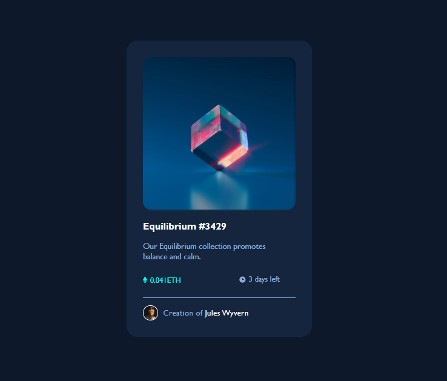
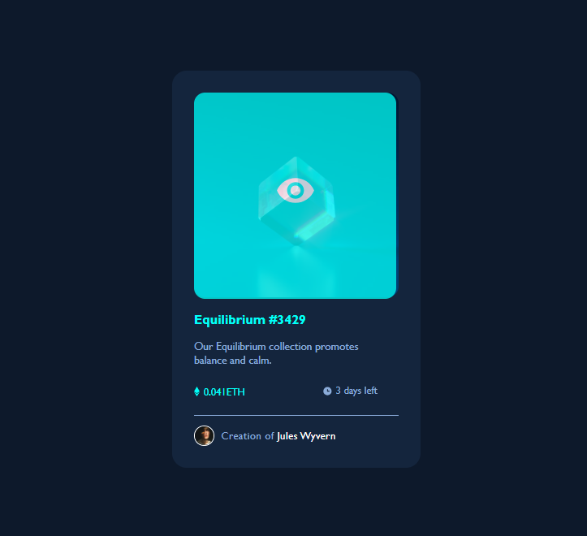

# Frontend Mentor - NFT preview card component solution

This is a solution to the [NFT preview card component challenge on Frontend Mentor](https://www.frontendmentor.io/challenges/nft-preview-card-component-SbdUL_w0U). Frontend Mentor challenges help you improve your coding skills by building realistic projects.

## Table of contents

- [Overview](#overview)
  - To create a web page showing the Preview of an NFT Card to include
    - Name of NFT in H2
    - Description of NFT in p
    - Price and Time Count-down to buy in a Grid-Display, where the price and time both invovles an image icon
    - Creator Profile Pic and Disclaimer in another Grid Display
- [Screenshot](#Screenshot)
- [My process](#my-process)
  - [Built with](#built-with)
  - [What I learned](#what-i-learned)
  - [Continued development](#continued-development)
  - [Useful resources](#useful-resources)
- [Author](#author)
- [Acknowledgments](#acknowledgments)

## Screenshot

## My process

1. Prepare the Main Card display as a flexbox inside the Browser webpage view
2. Place this in the center along the horizontal axis (justify-content) & vertical axis (align-items)
3. Place the image and the Asset Name in an <image> container, where this container is used to do some kinds of hover effect
4. Prepare the Grid and Sub-Grid arrangement for the Info
5. Create another hover layer with another image and a background-color
6. Set the opacity as 0
7. Create a CSS rule to update the Opacity to non-zero value while hovering over the <image> container

## Built with

- Semantic HTML5 markup
- CSS custom properties
- Flexbox
- CSS Grid

## Author

- Created by user - [Nobodyyyy2468]

## Acknowledgments

This is where you can give a hat tip to anyone who helped you out on this project.
